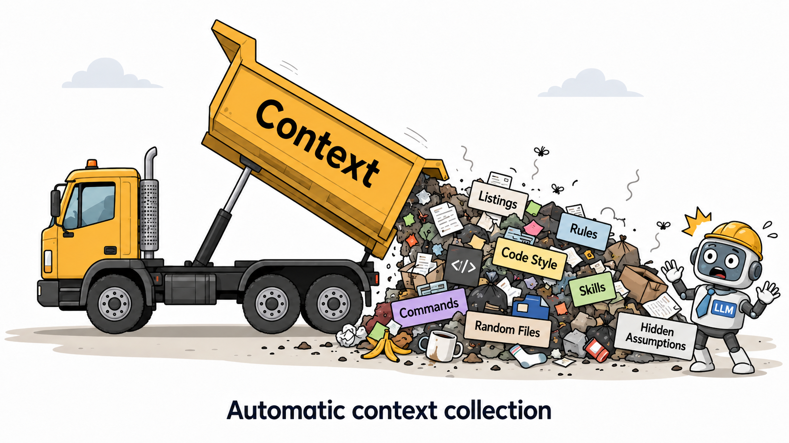
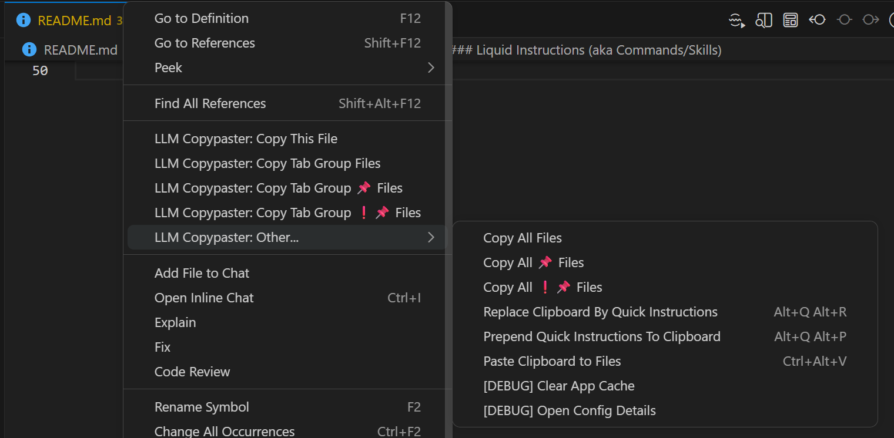
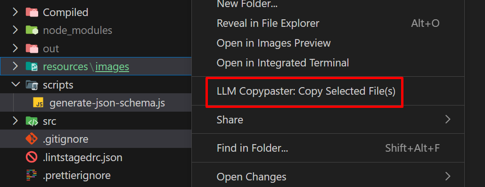
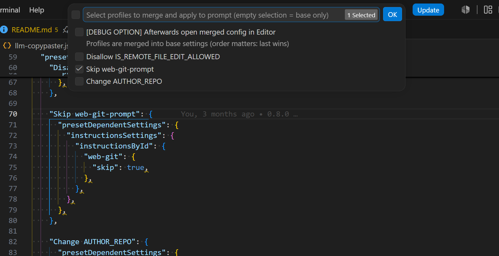
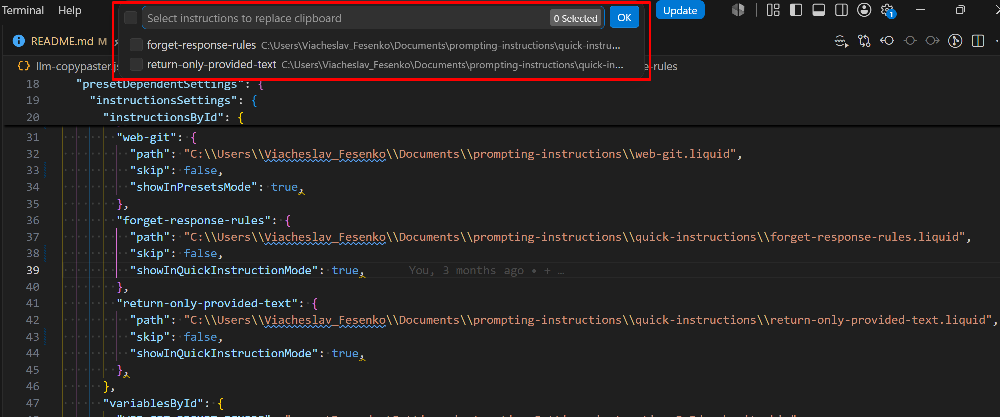

# LLM Copypaster

**Lightweight extension for developers who don’t want an AI agent to guess the context.**

Instead of sending an unknown amount of project context to an AI agent, you explicitly choose which files, folders and project instructions should be included in the prompt. The extension then helps you copy that context to any LLM interface and apply structured responses back into your project.

It works with ChatGPT, Claude, Gemini, local models, raw APIs, or any other LLM tool that can accept text input.

## Why not just use Codex, Cursor or Claude Code?

Codex, Cursor, Claude Code and similar tools can be amazing for projects with low to medium codebase complexity, vibe coding, experiments, prototypes, PoCs and fast exploration.

But on mature projects, legacy systems or large codebases, fully agentic tools can easily produce pseudo-positive results: the generated code may look correct at first glance, but after a deeper review it often requires serious rework. In many cases, the problem is not the model itself, but the context: too much irrelevant code, missing project rules, hidden assumptions or automatically selected files that should not have been part of the prompt.

**`LLM Copypaster` is built for a more explicit workflow.**

Instead of asking an AI agent to guess the right context, you decide what should be included. You can keep using your favorite LLM, but with a predictable, transparent and repeatable context-building process.

## Core capabilities

TODO: gif/youtube with the basic copy-paste scenario: show `Copy This File` from editor and explorer, then selected folders and files.

### IDE ←→ LLM Flow

The extension lets you quickly collect context from files and folders directly from VS Code using editor and explorer menu commands.

The basic scenarios include copying the current file, files from the current tab group, selected files or folders, and applying clipboard content back into the project. Other commands are close variations of the same workflow.

The extension can take an LLM response from the clipboard and apply it back to project files using the `Paste Clipboard to Files` command.

### Highly Extensible Config

TODO: show an example `llm-copypaster.json` with simple overrides compared to the system config, and demonstrate how it affects the final generated prompt.

### Liquid Instructions (aka Commands/Skills)

The key feature of the extension is not just copying files to the clipboard, but automatically adding project-specific instructions.

### Dynamic Overrides - Cover every context gathering case

Each Copy Action applies the default config. But when you need to tweak something for a specific context-gathering case, you can prepare it beforehand by adding a config override.

Because, let’s be honest, sooner or later every dev needs “almost the same thing, but slightly different this time”.

### Quick Instructions

Built-in quick instructions are like a tiny prompt notepad inside VS Code: useful user prompts that are not important enough to become full-blown skills or commands.

One shortcut, pick the needed quick instruction, and the prompt is copied/appended to the clipboard. No digging through random notes, no “where did I save that prompt again?” adventure.

### Enhanced Debugging & Tracing

Because the extension uses a pretty flexible user-managed three-level config, plus a bunch of read/write operations with the file system, it is kind of vital to understand what went wrong and why without taking a round-the-world trip through the console.

Whenever I personally tripped over something, I added convenient ways to figure out what happened. At least convenient from my point of view, which is legally close enough 😄

I’m not adding a screenshot here because there are quite a few such places.
