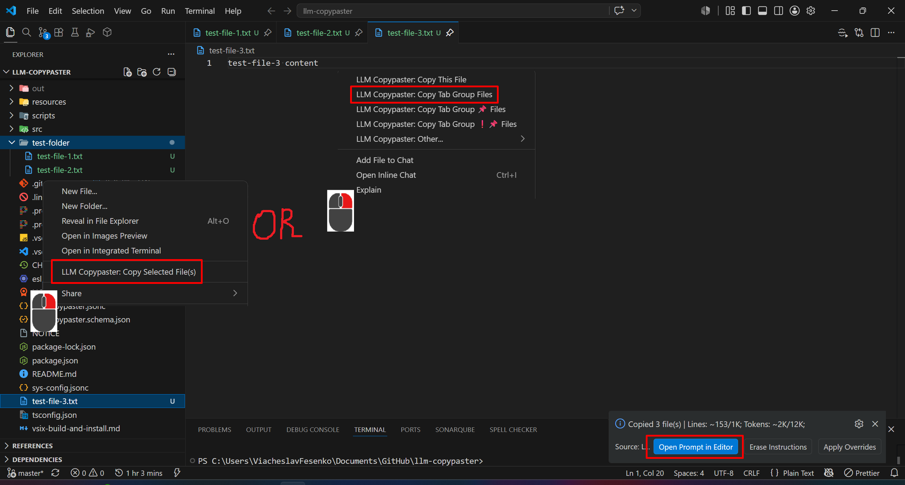
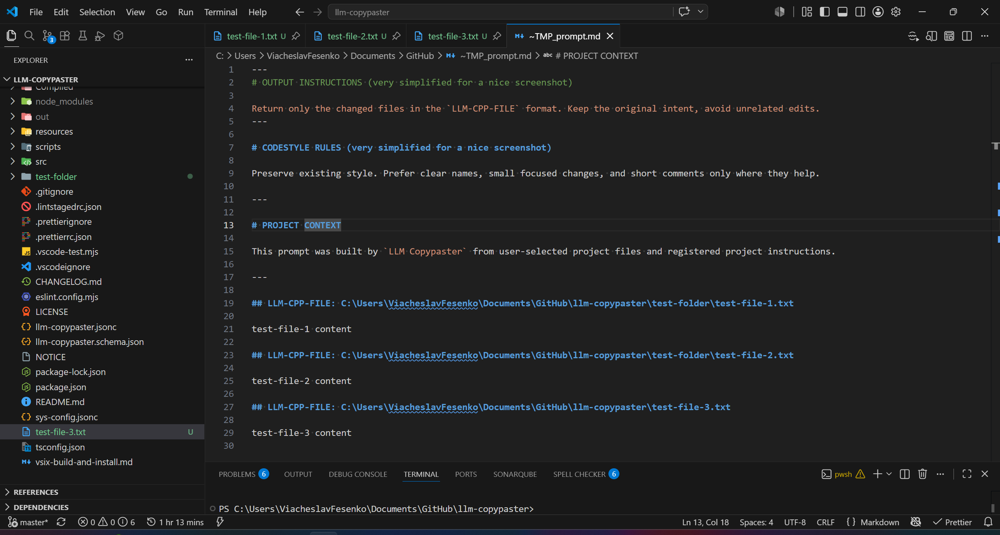
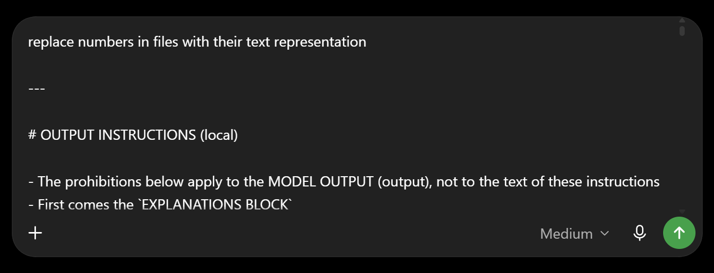
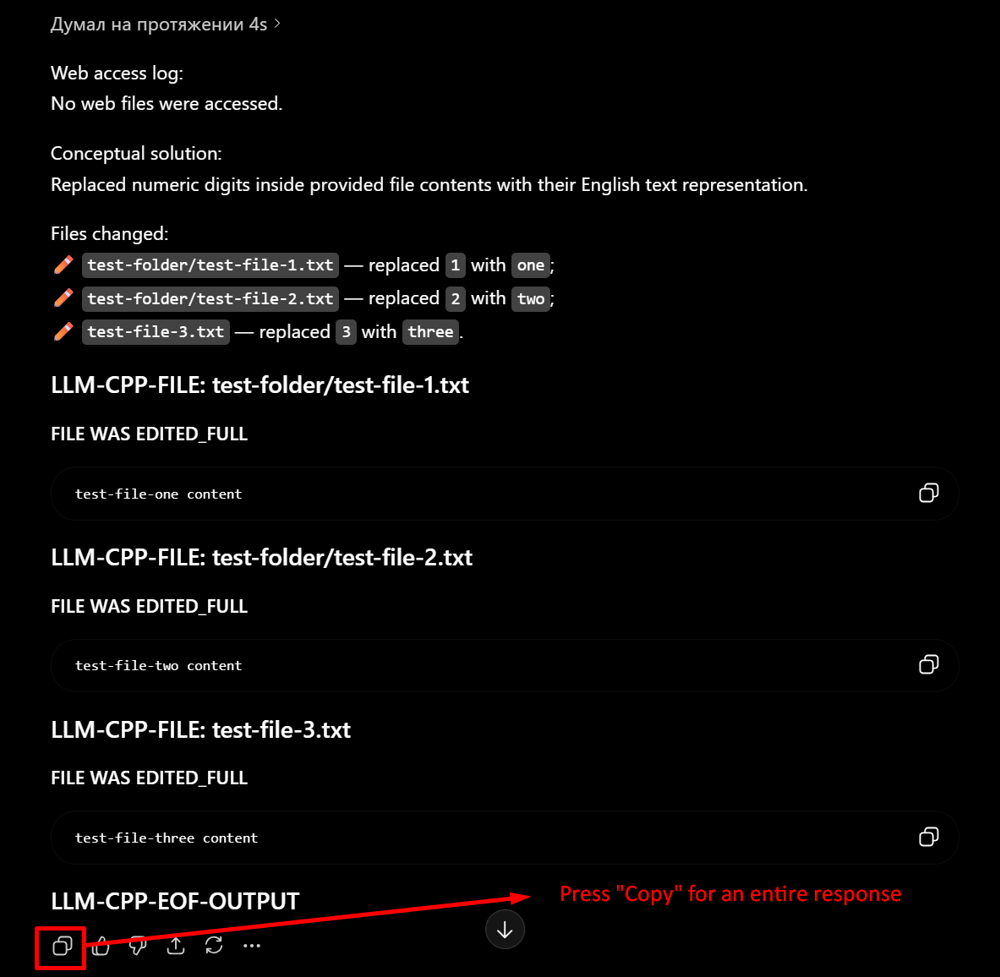
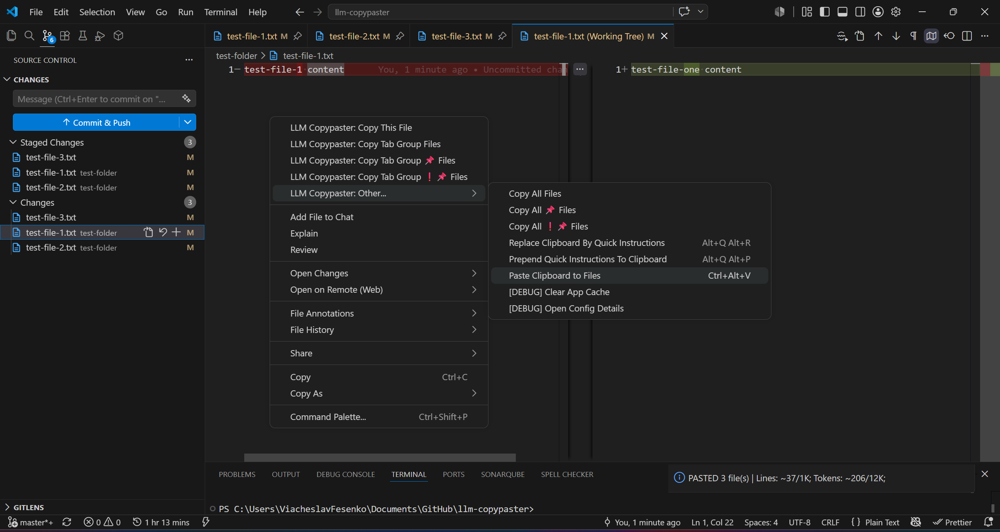
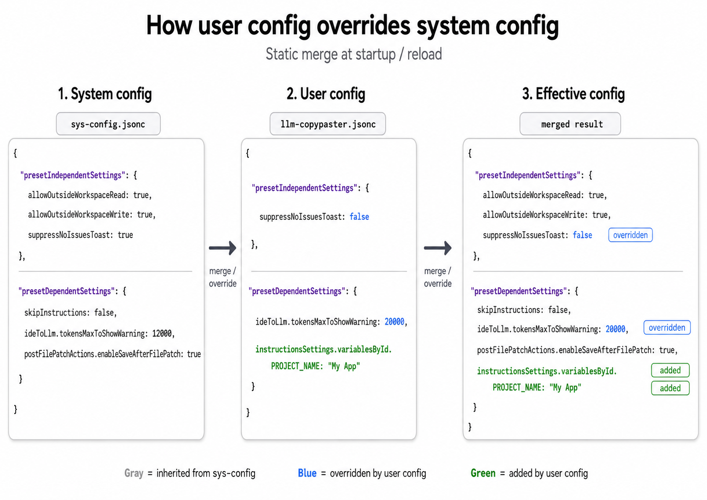
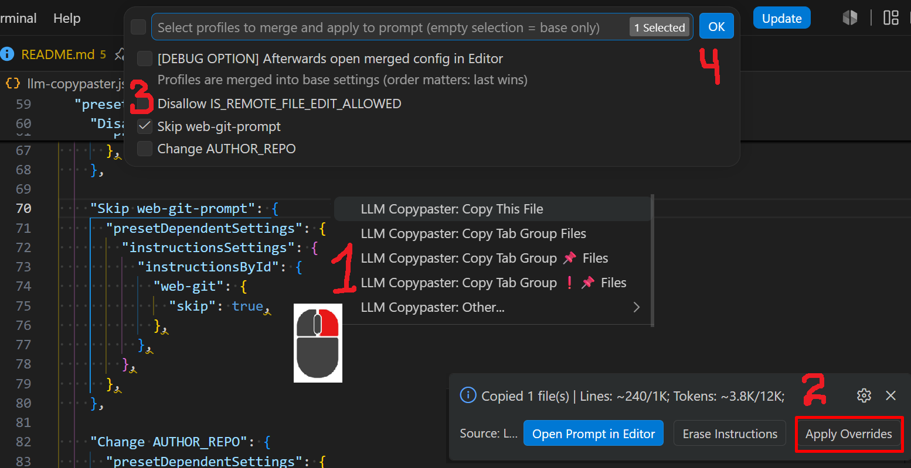
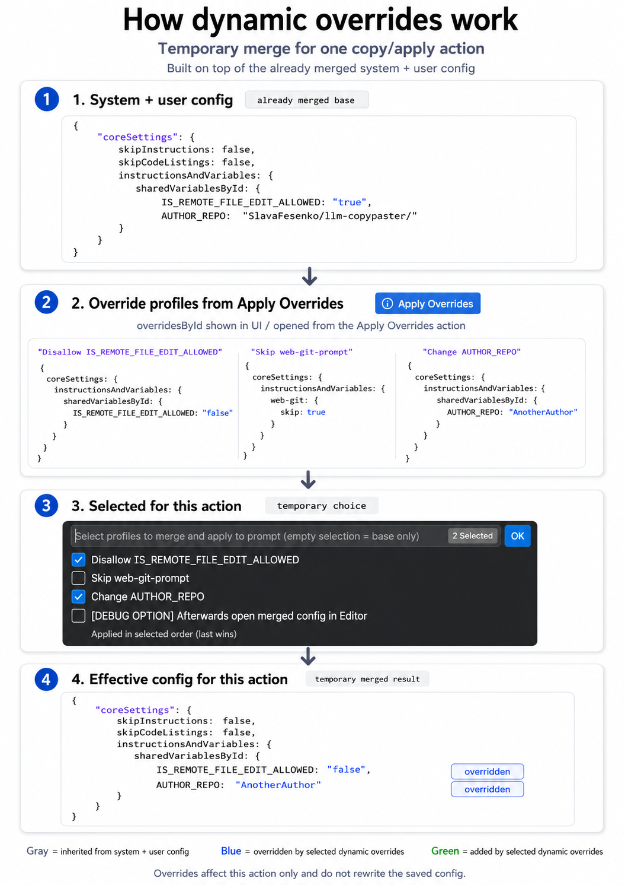
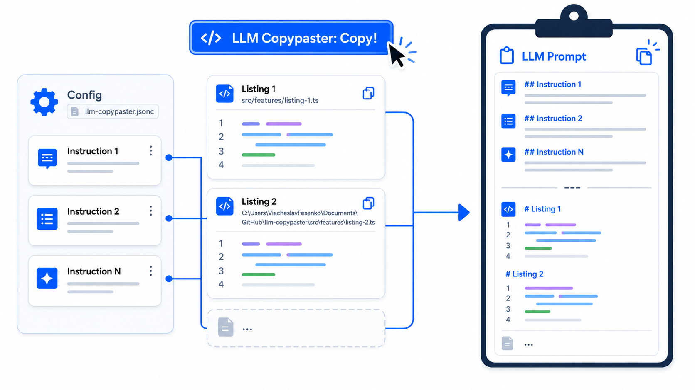
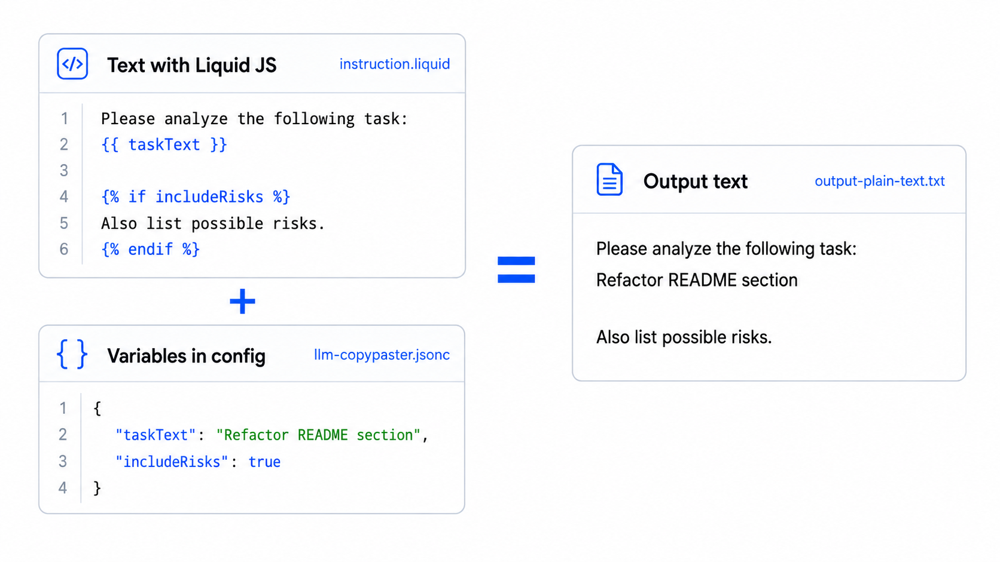

# LLM Copypaster

**Lightweight extension for developers who don’t want an AI agent to guess the context.**

Instead of sending an unknown amount of project context to an AI agent, you explicitly choose which files, folders, and project instructions should be included in the prompt. The extension then helps you copy that context to any LLM interface and apply structured responses back into your project.

In short: `LLM Copypaster` is not trying to replace your favorite AI tool. It gives you a predictable copy → prompt → response → apply workflow around it.

It works with ChatGPT, Claude, Gemini, local models, raw APIs, or any other LLM tool that can accept text input.

## Why not just use Codex, Cursor or Claude Code?

Codex, Cursor, Claude Code and similar tools can be amazing for projects with low to medium codebase complexity, vibe coding, experiments, prototypes, PoCs and fast exploration.

But on mature projects, legacy systems or large codebases, fully agentic tools can easily produce results that only look correct at first glance: the generated code may seem fine initially, but after a deeper review it often requires serious rework. In many cases, the problem is not the model itself, but the context: too much irrelevant code, missing project rules, hidden assumptions or automatically selected files that should not have been part of the prompt.

**`LLM Copypaster` is built for a more explicit workflow.**

Instead of asking an AI agent to guess the right context, you decide what should be included. You can keep using your favorite LLM, but with a predictable, transparent and repeatable context-building process.

## How to use

### Step 1: Copy project context from VS Code

Start by choosing exactly which files should be sent to the LLM.

You can copy the current file, selected files or folders from Explorer, files from the current tab group, or all files collected by one of the available `LLM Copypaster` commands.

After the copy action, the extension builds a prompt from the selected project files and registered instructions. The status notification shows how many files were copied, the approximate number of lines, and the estimated token count.

### Step 2: Review the generated prompt

Before sending anything to the LLM, you can optionally open the generated prompt in an editor tab. The prompt is already copied to the clipboard, so this step is only for review.

This is useful when you want to verify what exactly was collected: project instructions, project context, selected file paths, and file contents. The prompt is just plain text, so nothing is hidden behind magic agent behavior.

### Step 3: Paste the prompt into your LLM and add the user request

Paste the copied prompt into ChatGPT, Claude, Gemini, a local model, or any other LLM interface.

Then add the actual task you want the model to perform. For example, you can ask it to update files, refactor code, replace values, add documentation, or make any other focused change based on the provided context.

The important part is that the LLM receives both the selected project files and the output instructions needed to return a response in the `LLM-CPP-FILE` format.

### Step 4: Copy the full LLM response

When the LLM finishes, copy the entire response, not only a single code block.

The response should include the explanation block, every changed file in the `LLM-CPP-FILE` format, and the final `LLM-CPP-EOF-OUTPUT` anchor. The extension uses this structure to understand which files should be edited, created, or deleted.

And yes, the obvious question is: “Does the LLM really always follow this output format?”

Honestly, I’m still a bit shocked myself, but yes. I have used this extension for thousands of prompts, and the output format has not been broken even once. As long as the response instructions are included in the copied prompt, the model reliably returns the explanation block, structured `LLM-CPP-FILE` sections, and the final `LLM-CPP-EOF-OUTPUT` anchor.

### Step 5: Paste the LLM response back to files

Return to VS Code and run `LLM Copypaster: Paste Clipboard to Files`.

The extension reads the structured response from your clipboard and applies the described changes to the project files. After that, you can review the result using the regular Git diff, stage the changes, and commit them like any other manual edit.

> **WARNING:** Always review everything the LLM returned before committing it.
>
> `LLM Copypaster` applies the response exactly as structured, but it does not magically guarantee that the generated code is correct. Use Git diffs as the final source of truth.
>
> Personally, I recommend staging your current changes before every paste-shot. This way, after applying the LLM response, the diff shows only the latest generated changes. I use the same habit even when working with agentic tools like Codex, because clean diffs save nerves, time, and occasionally the whole evening ;=)

## Core capabilities

### IDE ←→ LLM Flow

The extension lets you quickly collect context from files and folders directly from VS Code using editor and explorer menu commands.

The basic scenarios include copying the current file, files from the current tab group, selected files or folders, and applying clipboard content back into the project. Other commands are close variations of the same workflow.

The extension can take an LLM response from the clipboard and apply it back to project files using the `Paste Clipboard to Files` command.

### Highly Extensible Config

`LLM Copypaster` ships ready to work out of the box. All required default variables, anchors, instruction settings and behavior switches live in the bundled [`sys-config.jsonc`](https://github.com/SlavaFesenko/llm-copypaster/blob/master/sys-config.jsonc), so the extension does not require any additional project config just to start working.

When you want to use more of the extension’s flexibility, add your own `llm-copypaster.jsonc` to the root of your project. This workspace config overrides or extends what is already defined in `sys-config.jsonc`: you can redefine existing settings, add project-specific instructions, provide Liquid variables, tune presets, adjust parsing anchors, or change any other supported config behavior.

As a working example, see this repository’s own [`llm-copypaster.jsonc`](https://github.com/SlavaFesenko/llm-copypaster/blob/master/llm-copypaster.jsonc). It is the config I use for developing `LLM Copypaster` itself, so it shows how the extension author overrides the system config to use Copypaster on its own source code.

> **WARNING:** After changing user config, run `Developer: Reload Window` in the IDE to apply it.

Of course, this config format deserves proper dedicated docs. Since the project is open-sourced — feel free to contribute :=)

### Dynamic Overrides

Each Copy Action applies the default config. But when you need to tweak something for a specific context-gathering case, you can prepare it beforehand by adding a config override.

Because, let’s be honest, sooner or later every dev needs “almost the same thing, but slightly different this time”.

A bit about how it works. It may seem scary, I know — it’s an advanced feature, and not everyone needs it.
Note that everything in the `presetDependentSettings` block may be changed by an override. Variables are changed most frequently in practice, however.

> **WARNING:** Dynamic Override is temporary and applies only to the current copy-shot. The next copy-shot will use the default config again.

### Instructions (aka Commands/Skills)

The extension can automatically add project instructions to the copied context. Instead of keeping the same rules in random markdown files, notes or half-forgotten chat bookmarks, you store instruction texts in physical files, register those files in the config, and let LLM Copypaster attach them automatically — unless this behavior is disabled in the project config.

### Liquid.JS support in Instructions

Instructions can be plain text, but they can also be written as [LiquidJS](https://liquidjs.com/) templates. This means an instruction file may contain variables, conditions and small formatting branches, while project-specific values stay in `llm-copypaster.jsonc`.

For example, you can keep one shared instruction template somewhere on your PC, then tune its behavior per project through config: output format, response style, enabled sections, framework-specific rules, strictness level, or any other small difference that would otherwise force you to duplicate the whole prompt.

In other words: the instruction stays reusable, and the config decides how it should behave in this exact project.

### Quick Instructions

Built-in quick instructions are like a tiny prompt notepad inside VS Code: useful user prompts that are not important enough to become full-blown skills or commands.

One shortcut, pick the needed quick instruction, and the prompt is copied/appended to the clipboard. No digging through random notes, no “where did I save that prompt again?” adventure.

Guess what? These instructions support LiquidJS too!

### Enhanced Debugging & Tracing

Because the extension uses a pretty flexible user-managed three-level config, plus a bunch of read/write operations with the file system, it is kind of vital to understand what went wrong and why without taking a round-the-world trip through the console.

Whenever I personally tripped over something, I added convenient ways to figure out what happened. At least convenient from my point of view, which is legally close enough ;=)

I’m not adding a screenshot here because there are quite a few such places.

This includes output channels, trace-friendly messages, and small diagnostics around config resolution, file collection, parsing, and apply operations.
